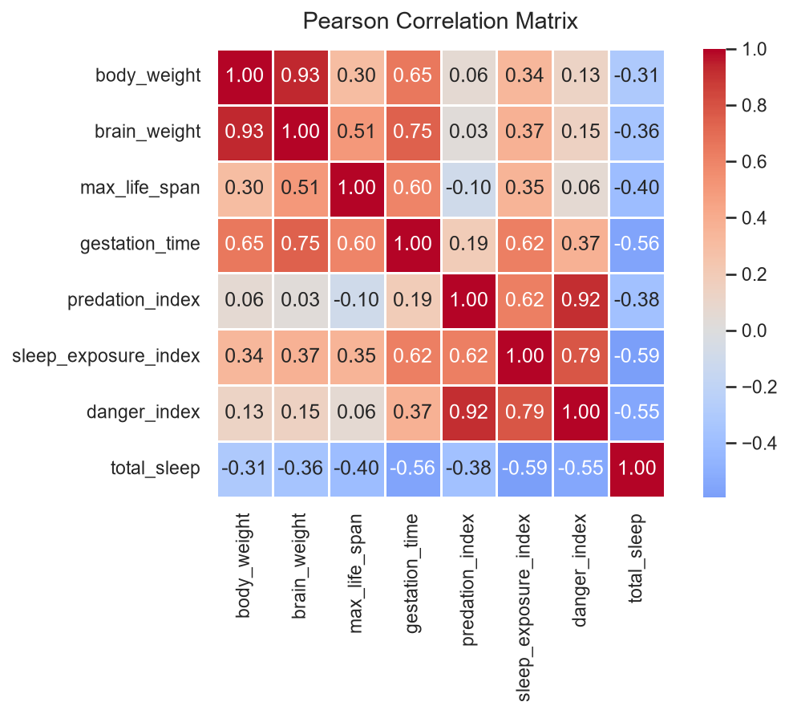
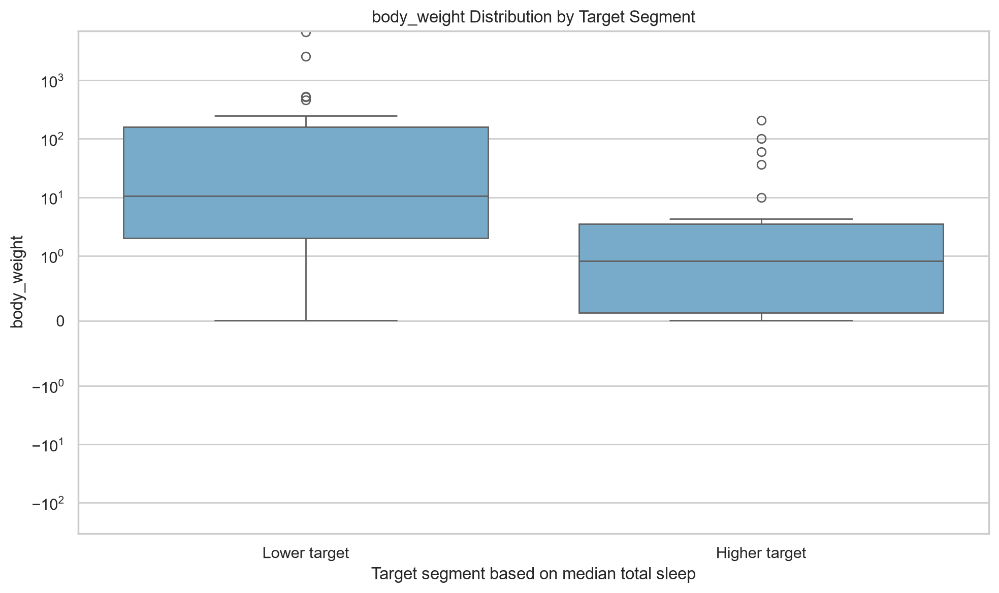

# Executive EDA & Dataset Summary Report
**Target Directory:** `C:\Users\Anish Kumar Verma\PycharmProjects\AutoEDA\sandbox_run`
**Processed Files:** `correlation_matrix.png`, `metadata_profile.json`, `metrics.json`, `target_interactions.png`
**Excluded Files:** `generated_analysis.py` (Script excluded from summary)

---

## 1. Dataset Overview
- **Dataset Identifier:** `dataset_2191_sleep.csv`
- **Dimensions:** `62` rows x `12` columns
- **Target Variable:** `total_sleep`
- **Data Quality:** No missing values detected in raw profile.

---

## 2. Data Imputation & Preprocessing
- **rules_applied:** {'numeric_skewed': 'Median imputation when skewness > 1 or skewness < -1.', 'numeric_symmetric': 'Mean imputation when -1 <= skewness <= 1.', 'categorical': 'Mode imputation, or Unknown if no mode exists.', 'missing_tokens_replaced': ['?', '', 'NA', 'N/A', 'null', 'None', 'nan']}
- **columns:** {'body_weight': {'dtype_before': 'float64', 'dtype_after': 'float64', 'missing_count_before': 0, 'missing_count_after': 0, 'skewness': 6.563608062833757, 'method': 'median', 'fill_value': 3.3425}, 'brain_weight': {'dtype_before': 'float64', 'dtype_after': 'float64', 'missing_count_before': 0, 'missing_count_after': 0, 'skewness': 5.071589456939673, 'method': 'median', 'fill_value': 17.25}, 'max_life_span': {'dtype_before': 'float64', 'dtype_after': 'float64', 'missing_count_before': 4, 'missing_count_after': 0, 'skewness': 2.013759505306088, 'method': 'median', 'fill_value': 15.1}, 'gestation_time': {'dtype_before': 'float64', 'dtype_after': 'float64', 'missing_count_before': 4, 'missing_count_after': 0, 'skewness': 1.6835007981286436, 'method': 'median', 'fill_value': 79.0}, 'predation_index': {'dtype_before': 'int64', 'dtype_after': 'int64', 'missing_count_before': 0, 'missing_count_after': 0, 'skewness': 0.22951866524133507, 'method': 'mean', 'fill_value': 2.870967741935484}, 'sleep_exposure_index': {'dtype_before': 'int64', 'dtype_after': 'int64', 'missing_count_before': 0, 'missing_count_after': 0, 'skewness': 0.6795356866646011, 'method': 'mean', 'fill_value': 2.4193548387096775}, 'danger_index': {'dtype_before': 'int64', 'dtype_after': 'int64', 'missing_count_before': 0, 'missing_count_after': 0, 'skewness': 0.3776558762515312, 'method': 'mean', 'fill_value': 2.6129032258064515}, 'total_sleep': {'dtype_before': 'float64', 'dtype_after': 'float64', 'missing_count_before': 4, 'missing_count_after': 0, 'skewness': 0.20124523613049983, 'method': 'mean', 'fill_value': 10.532758620689652}}

---

## 3. Outlier Analysis (IQR Method)
| Column | Outlier Count | Outlier Percentage | Bounds (Lower / Upper) |
|---|---|---|---|
| `method` | IQR rule: below Q1 - 1.5*IQR or above Q3 + 1.5*IQR | N/A | N/A |
| `numeric_columns` | N/A | N/A% | [N/A, N/A] |

---

## 4. Engineered Features
- **`brain_body_ratio`**: Formula: `Custom transformation` | Purpose: Enhance predictive signal
- **`log_body_weight`**: Formula: `Custom transformation` | Purpose: Enhance predictive signal
- **`log_brain_weight`**: Formula: `Custom transformation` | Purpose: Enhance predictive signal
- **`gestation_sleep_ratio`**: Formula: `Custom transformation` | Purpose: Enhance predictive signal

---

## 5. Statistical Hypothesis Testing
- **Statistically Significant Predictors:** `body_weight`, `brain_body_ratio`, `brain_weight`, `danger_index`, `gestation_sleep_ratio`, `gestation_time`, `log_body_weight`, `log_brain_weight`, `max_life_span`, `predation_index`, `sleep_exposure_index`
- **`tests_by_feature`** (Hypothesis Test): p-value = `N/A` | Significant: `False`
  - *Interpretation:* N/A

---

## 6. Generated Visual Artifacts
- **** - `correlation_matrix.png` (388.47 KB)
- **** - `target_interactions.png` (55.81 KB)

---

## 7. Predictive Modeling Strategy Blueprint
### Target Definition
- **column:** total_sleep
- **problem_type:** Supervised regression
- **description:** Predict continuous total sleep duration.
### Recommended Algorithms
- Median baseline regressor
- Regularized linear regression
- Random Forest Regressor
- Gradient Boosting Regressor
- HistGradientBoostingRegressor
### Feature Selection Strategy
- Use domain features such as brain_body_ratio and logarithmic weight features.
- Remove identifiers and leakage-prone fields if present.
- Inspect redundancy using the correlation matrix.
- Use repeated cross-validated permutation importance.
- Prefer compact feature sets because of the small sample size.
### Validation Strategy
- Use repeated 5-fold cross-validation.
- Place imputation, transformations, scaling, and encoding inside a Pipeline.
- Report MAE, RMSE, and R-squared with variability estimates.
- Compare all models against the median-target baseline.
### Preprocessing Steps
- Replace '?' and other placeholder strings with missing values.
- Parse numeric-looking strings explicitly to float64.
- Use median imputation for skewed numeric fields.
- Use mean imputation for symmetric numeric fields.
- Use mode or Unknown for categorical fields.
- Apply log1p transformations to heavily skewed positive variables.
- Standardize predictors for regularized linear models.
- One-hot encode remaining categorical predictors.
### Overfitting Risk Mitigation
- Use regularization and constrained tree depth.
- Use minimum leaf-size constraints for tree ensembles.
- Avoid repeated tuning against final evaluation data.
- Use repeated cross-validation because there are only 62 rows.
- Investigate influential observations and robust alternatives.
- Prefer stable performance over marginal improvements.
- **Overall Executive Modeling Strategy Summary:** Start with a transparent median baseline and regularized regression using log-transformed size variables and biologically motivated ratios. Compare against constrained tree ensembles using repeated cross-validation. Prioritize MAE and stability because the dataset is small and contains extreme values.

---

*Report generated automatically by `summary_generator.py`*